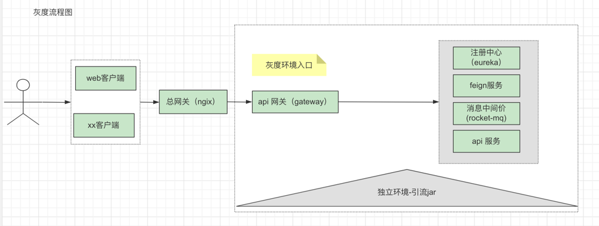
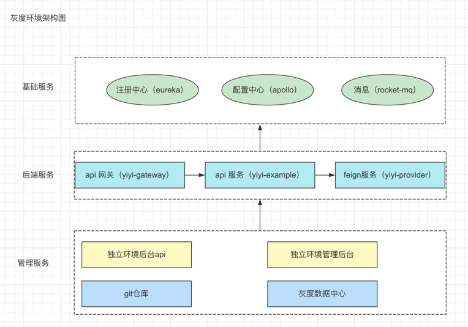

# 1. 介绍

## 1.1 实现的核心逻辑

核心实现思想：以需求创建项目代码分支，创建独立的需求测试环境，即将涉及此需求改动的项目部署到一个环境中，其他不变的项目使用公共QA;

实现前提：

1）服务部署时，携带对应的环境标识；

2）面向前端提供的服务，要有相应的api网关服务；

实现逻辑：

1）从客户端携带当前测试的环境编号（header 中添加相应的`环境变量`）；

2）网关（nginx）透传 ；

3）api网关根据环境变量选择 对应环境的api服务（没有走默认负载均衡策略）；

4）api服务在请求 微服务、mq等中间件是携带`环境变量`；


灰度流程如下：


灰度环境架构图：



# 2. 核心代码解读

开始解读前，思考一下几个问题？

1）服务的灰度范围，哪些服务需要，哪些不需要？

2）服务本身是否要带灰度标识？

3）如何服务本身不携带标识，那服务灰度标识存到哪里？

4）后端架构中间件的负载均衡组件是否一致，能不能抽离出一套公用的？


## 2.0 eureka 服务注册灰度环境适配


eureka 作为注册中心，本身就是存储服务元信息的，因此作为服务标识存储位置再合适不过了。

😄改造就完事了；


经过研究哈，自定义这个：eureka.instance.instance-id ，就👌🏻了；

处理后服务注册到eureka 的效果如下：


## 2.1 api 网关灰度环境适配

这里我们以spring-cloud-gateway为例搞一哈；

对spring-cloud-gateway不了解的，可以参见这个：[gateway 学习](https://www.yuque.com/anhusky/middle_ware/hnlzwb)

改造前，先思考我们需要在哪一步改造，😄，当然是转发请求，选择服务的时候进行了；

下面是gateway 请求链路图：


选哪个作为切入点了？ 自然是 LoadBlancedClientFilter 了，😄这个看着就很亲切；

我们自定义LoadBlancedClientFilter 将灰度标识存入threadlocal;

因为底层选择服务是ribbon，我们自定义ruler即可完成 服务选择规则的重定义；

自定义LoadBlancedClientFilter：

```java
@Component
@ConditionalOnProperty(name = "enable_gray_env")
public class GrayEnvLoadBalancerClientFilter extends LoadBalancerClientFilter {
    public GrayEnvLoadBalancerClientFilter(LoadBalancerClient loadBalancer, LoadBalancerProperties properties) {
        super(loadBalancer, properties);
    }


    @Override
    protected ServiceInstance choose(ServerWebExchange exchange) {

        // 获取入口环境，存入threadLocal
        ServerHttpRequest request = exchange.getRequest();
        HttpHeaders headers = request.getHeaders();
        String podEnv = headers.getFirst(Constants.POD_ENV);
        if(StringUtils.isNotEmpty(podEnv)){
            EnvHolder.setEnv(Constants.POD_ENV,podEnv);
        }

        return super.choose(exchange);
    }
}
```


自定义ruler

```java
public class GrayEnvRuler extends ZoneAvoidanceRule {

    private Logger logger = LoggerFactory.getLogger(GrayEnvRuler.class);

    /**
     * 灰度环境开关
     */
    @Value("${enable_gray_env:false}")
    private Boolean enableGrayEnv;

    /**
     * 当前环境
     */
    @Value("${env}")
    private String env;

    /**
     * 允许灰度的环境
     */
    @Value("${gray_envs}")
    private String grayEnvs;

    @Override
    public void initWithNiwsConfig(IClientConfig clientConfig) {
    }

    @Override
    public Server choose(Object key) {
        if(!enableGrayEnv){
            return super.choose(key);
        }

        // 不在允许的环境，走默认轮询
        List<String> enableGrayEnvList = Arrays.asList(grayEnvs.split(","));
        if (!enableGrayEnvList.contains(env)) {
            return super.choose(key);
        }

        ILoadBalancer lb = getLoadBalancer();
        if (Objects.isNull(lb)) {
            return null;
        }

        // 获取已激活的服务
        List<Server> serverList = lb.getReachableServers();
        // 获取入口环境
        String podEnv = EnvHolder.getEnv(Constants.POD_ENV);

        if(StringUtils.isNotEmpty(podEnv)){
            EnvHolder.clear();
        }

        for (Server server : serverList) {
            String instanceId = server.getMetaInfo().getInstanceId();
            List<String> instanceIdList = Arrays.asList(instanceId.split(":"));
            if (instanceIdList.size() != 3) {
                continue;
            }
            // id 格式： eureka.instance.instance-id=${spring.cloud.client.ipaddress}:${server.port}:${pod_env}
            String instancePodEnv = instanceIdList.get(2);

            if (StringUtils.equals(instancePodEnv, podEnv)) {
                // 匹配到对应的 业务环境服务
                return server;
            }
        }
        return super.choose(key);
    }
}
```


## 2.2 feign 服务调用灰度环境适配

feign-core 一般用于spring-cloud 服务之前的调用，负载均衡也是用ribbon ,即切换还用我们上边定义的ruler就可以；

问题又来了，请求中的环境标识从哪里放进去呢？这个由于有用户请求，直接找拦截器就OK了；

实现RequestInterceptor 即可；

下面是实现：

```java
@Configuration
public class FeignHeaderIntercept implements RequestInterceptor {

    private Logger logger = LoggerFactory.getLogger(FeignHeaderIntercept.class);

    @Override
    public void apply(RequestTemplate template) {
        ServletRequestAttributes requestAttributes = (ServletRequestAttributes)RequestContextHolder.getRequestAttributes();
        if(Objects.isNull(requestAttributes)){
            return;
        }

        HttpServletRequest request = requestAttributes.getRequest();
        Enumeration<String> headerNames = request.getHeaderNames();

        if(Objects.isNull(headerNames)){
            return ;
        }

        boolean xForwardIpExist = false;
        while (headerNames.hasMoreElements()){
            String name = headerNames.nextElement();
            String values = request.getHeader(name);

            // 获取用户真实IP
            if (name.equalsIgnoreCase(Constants.X_FORWARDED_FOR)) {
                if(IpUtils.isLocalAddress(values)){
                    values = IpUtils.getIpAddr(request);
                }
                template.header(Constants.X_FORWARDED_FOR,values);
                xForwardIpExist = true;
            }

            // 自定义http header 获取
            if(name.startsWith(Constants.POD_ENV)){
                values = request.getHeader(name);
                logger.info("http 拦截 header : name = {},values = {}",name,values);
                template.header(name,values);

                EnvHolder.setEnv(Constants.POD_ENV,values);
            }
        }

        if(!xForwardIpExist){
            String remoteAddr = IpUtils.getIpAddr(request);
            logger.info("http x-forwarded-for 增加remoteAddr header : {}",remoteAddr);
            template.header(Constants.X_FORWARDED_FOR,remoteAddr);
        }
    }
}
```

## 2.3 rocket-mq 灰度环境适配


这个不着急哈，先整体穿一下，跑通后，其他的就是添砖加瓦了；

# 3. 灰度案例

根据第二步，我们做一个简单给出简易版的架构图；


demo 服务部署完工后eureka效果;


神马，demo 在哪？怎么玩，都tm 看到这了，自个动手呗，😄！！！
