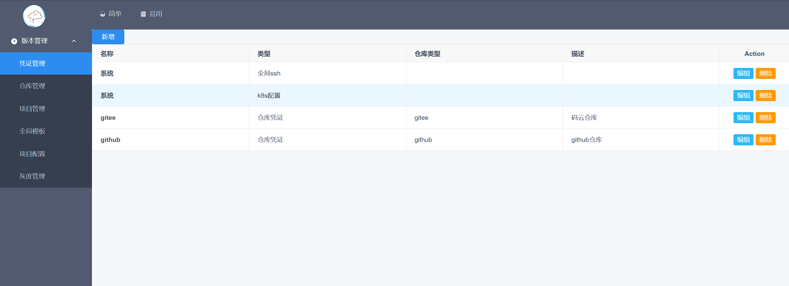

# 项目启动

## clone 项目

```shell
git clone git@github.com:haopenge/easy-devops.git
```

## 启动后端项目

### 配置数据库

替换[bootstrap.yaml](../../easy-devops-admin-api/src/main/resources/bootstrap.yaml) 中的datasource信息

> 目前数据库仅支持mysql

### 全局构建

```shell
# 项目根目录下执行
mvn clean package
```

### 启动main函数
```shell
启动 com.easy.devops.api.EasyDevopsAdminApiApplication
```

### 前端打包

```shell
cd easy-devops-front
npm install
```

### 启动前端项目

```shell
npm run serve
```

## 访问主页

```shell
http://localhost:8081/
```


# 项目使用
## 凭证管理

- 新增ssh私钥，用于拉取仓库代码


- 新增git仓库授权码,用于通过api获取仓库信息，目前支持github、gitee、gitlab


## 仓库管理


- 选择凭证


- 点击名称输入框，输出项目名自动匹配对应凭证远程仓库项目


## 项目管理

- 新增项目-选择仓库


- 新增项目-选择分支


## 全局模板

- 新增全局模板


## 项目配置

### 构建配置

- 检出
- 新增脚本


- TODO 挂载模板（）

### 发布配置


